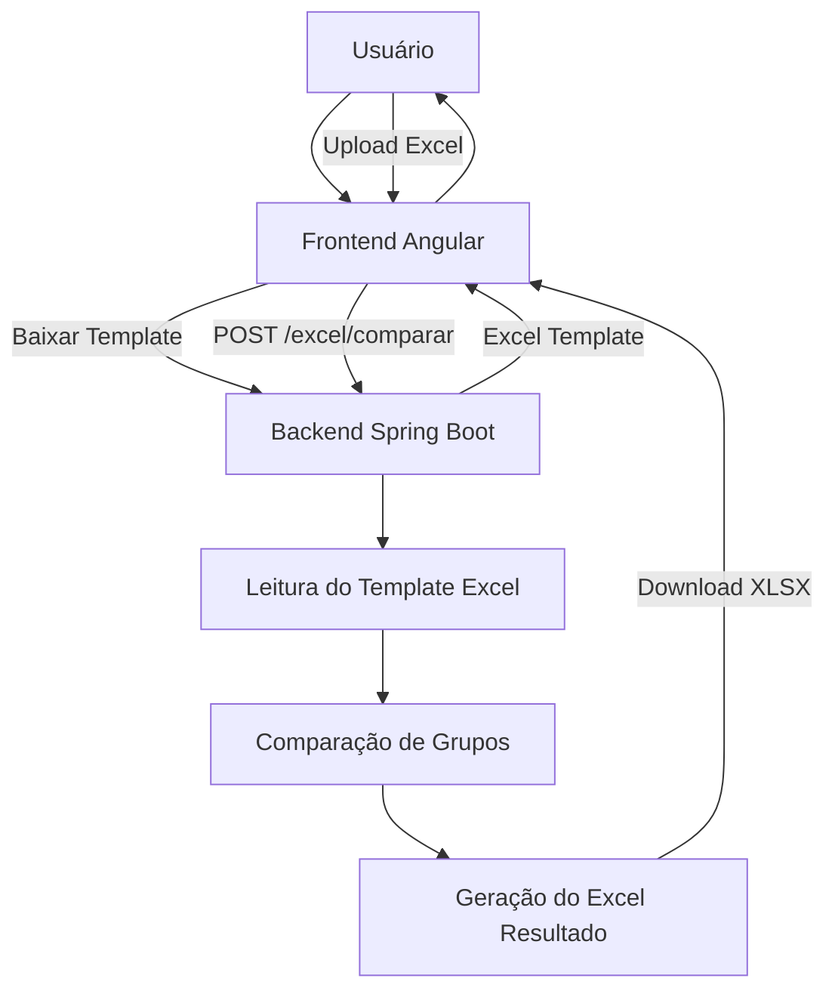

# Excel Group Comparator

Aplicação web para **comparação de grupos de usuários a partir de uma planilha Excel padrão**, gerando automaticamente um **Excel de resultado formatado**, indicando quais grupos devem ser adicionados. utilizao ela no meu dia a dia para facilitar a visualizaçõa na hora revisar acessos de usuários adicionar e remover acessos.

---

## 🧩 Visão Geral

A aplicação permite que o usuário:

1. Baixe um **template Excel padrão**
2. Preencha os dados de comparação
3. Envie o arquivo pelo frontend Angular
4. Receba um **Excel de resultado formatado**, pronto para uso

Não há uso de banco de dados. Todo o processamento é feito em memória.

---

## 🏗️ Arquitetura

- **Frontend:** Angular 19 (Standalone)
- **Backend:** Java 21 + Spring Boot 3
- **Processamento Excel:** Apache POI
- **Comunicação:** REST (multipart/form-data)
- **Formato:** XLS / XLSX

---

## 🔄 Fluxo da Aplicação



---

## 📂 Estrutura do Projeto

```text
backend/
 └── src/main/java
     └── backend_grupos
       |  ├── config
       |  ├── controller
       |  ├── model
       |  ├── service
       | └── util
       └── resourses
            └──templates 
frontend/
 └── src/app
     ├── services
     └── app.component.ts
```

---

## 📥 Template Excel

O template possui campos padronizados para:

- Usuário de referência
- Grupos do usuário de referência
- Usuário comparado
- Grupos do usuário comparado

O backend **lê diretamente o template**, sem recriar planilhas do zero.

---

## 📤 Resultado Gerado

A planilha de resultado contém:

- Cabeçalho destacado (verde)
- Bordas em todas as células
- Ajuste automático de largura
- Lista de **grupos a adicionar**

---

## 🎥 Vídeo Demonstrativo

[](https://www.youtube.com/watch?v=2GHNWHutSsA)

---

## ▶️ Como Executar

### Backend

```bash
./mvnw spring-boot:run
```

Backend disponível em:

```
http://localhost:8080
```

### Frontend

```bash
npm install
npm start
```

Frontend disponível em:

```
http://localhost:4200
```

---

## ✅ Funcionalidades

- Upload de Excel (XLS/XLSX)
- Download de template
- Comparação automática de grupos
- Geração de Excel formatado
- Barra de progresso
- Layout responsivo
- CORS isolado no backend

---

## 📌 Licença

Desenvolvido por Filipe Cândido Rodrigues
